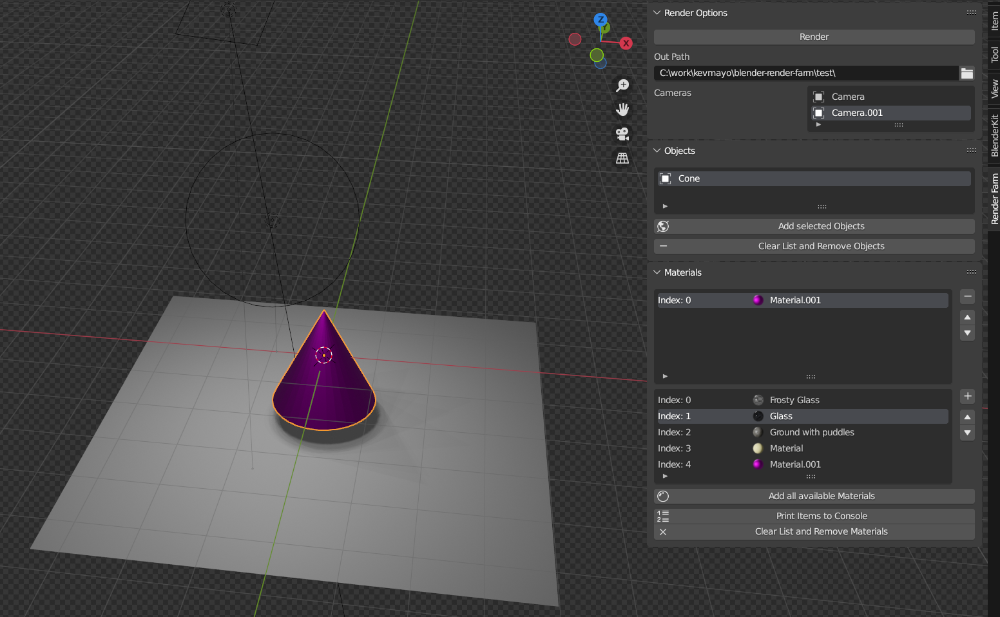

# Blender Render Farm Plugin

Blender Add-on for automating rendering of multiple items, materials and cameras.



By selecting materials and objects, the Render Farm add-on plugin will automate the rendering of each camera and save the images in a filefolder of your choice. 


## Installation

From Blender (Edit/Preferences/Install..) locate and install the file out/blender-render-farm.zip

## Contributing

To test the add-on locally, make sure you have a Blender on your PATH.
Then run:

```
python dev.py test --install-at /path/to/blender/3.2/scripts/addons
```

To reload the add-on in Blender, paste the following script into blender script editor and compile :

```
import bpy
 
bpy.ops.preferences.addon_enable(module='blender-render-farm')

```